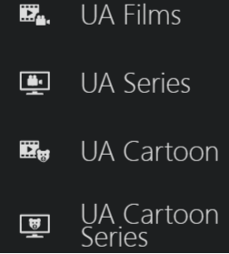

# 📺 Lampac Plugins – Нові додатки та можливості

Ласкаво просимо до неофіційного репозиторію додатків для **Lampac**!  
Тут ви знайдете найновіші плагіни, які розширюють функціональність сервісу.

## 🔥 Нові можливості
🔹 [**Фільмотека**](https://mastermagic98.github.io/l_plugins/cat_ua.js) – каталог українського контенту

Скрін

🔹 [**Логотипи**](https://mastermagic98.github.io/l_plugins/logo_title.js) – логотипи замість назви 

🔹 [**Трейлер**](https://mastermagic98.github.io/l_plugins/upcoming.js) – трейлери з YouTube

🔹 [**Трейлер**](https://mastermagic98.github.io/l_plugins/es.js) – статусу серіалу і кількість епізодів

Скрін

## 📢 Останні оновлення
🔹 **v1.0 – Статус серіалів** (дата релізу: 2025-03-14) Залжно від статусу серіалу виводиться інформація (скаовано,завершено, знімається і кількість епізодів)

🔹 **v1.2 – Трейлер** (дата релізу: 2025-06-06) Плагін для платформи Lampa додає розділ із трейлерами, інтегруючись із API The Movie Database (TMDB). Він:
    Завантажує дані: Використовує TMDB API для отримання інформації про фільми та серіали в категоріях "Популярні фільми", "У прокаті", "Скоро в кіно", "Популярні серіали", "Нові серіали та сезони", "Скоро на ТБ".
    Фільтрує контент: Виключає небажані жанри та ключові слова, перевіряє дати релізу та рейтинги.
    Відображає картки: Створює картки з трейлерами через об’єкт Trailer, показуючи назву, дату прем’єри, рейтинг, мову трейлера та, для серіалів, номер сезону/епізоду.
    Мова трейлеру: перевага віддається мові інтерфейсу (UA, Ru, EN), а за відсутності дубляжу - EN.
    Інтерактивність: Дозволяє переглядати трейлери на YouTube, гортати списки, переходити до детальної інформації.
    Адаптивність: Підлаштовується під мову користувача та розмір екрана, використовуючи шаблони Lampa.
    Проведено зміни, щоб не булоконфліктів з оригіналом CUB.

🔹 **v2.0 – Фільмотека** (дата релізу: 2025-03-14) Додані каталоги україніські мультфільми і  телесеріали, онолені іконки категорій

🔹 **v3.0 - Логотипи** (дата релізу: 2025-04-25) Додано:
- логотипи для серіалів;
- для фільмів/серіалів без логотипу uk/ru додано логотип en;
- збільшено якість логотипу;
- додано логіку відображення логотипів на різних пристроях;
- додано 2 режими відображення.

🔹 **v3.0 - Логотипи** (дата релізу: 2025-04-26) Змінено:
- виправлено відображення логотипів для старих карток на мобільних і звичайних пристроях.
